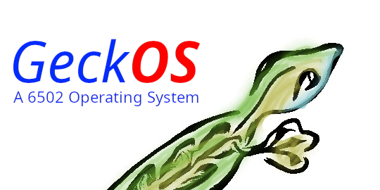

= GeckOS Operating System for the 6502 processor
(c) 1989-2023 A. Fachat (afachat@gmx.de)

This repository maintains the GeckOS/A65 source.

GeckOS comes of course with no warranty in any form. See
the file COPYING for the GNU public license.

The doc directory contains all necessary documentation (in asciidoc mostly).
I propose reading link:doc/index.adoc[doc/index.adoc] first.

The link:RELEASE.adoc[RELEASE NOTES] describe what's new in the current release.

In the repository, kernel, lib6502, devices and include are general source directories.

The *apps* folder holds pure lib6502 applications, like a shell, mkdir, etc.
They should also assemble for other lib6502 operating systems.

*sysapps* holds OS/A65 specific programs, like the slipd, or the
filesystem servers.

The previous directories are very independent from the actual system architecture.
The *arch* directory holds the architecture specific parts. It contains a directory
for each supported architecture. "proto" holds a prototype architecture
that can be used for porting.

Have fun!

22sept2023 André Fachat

