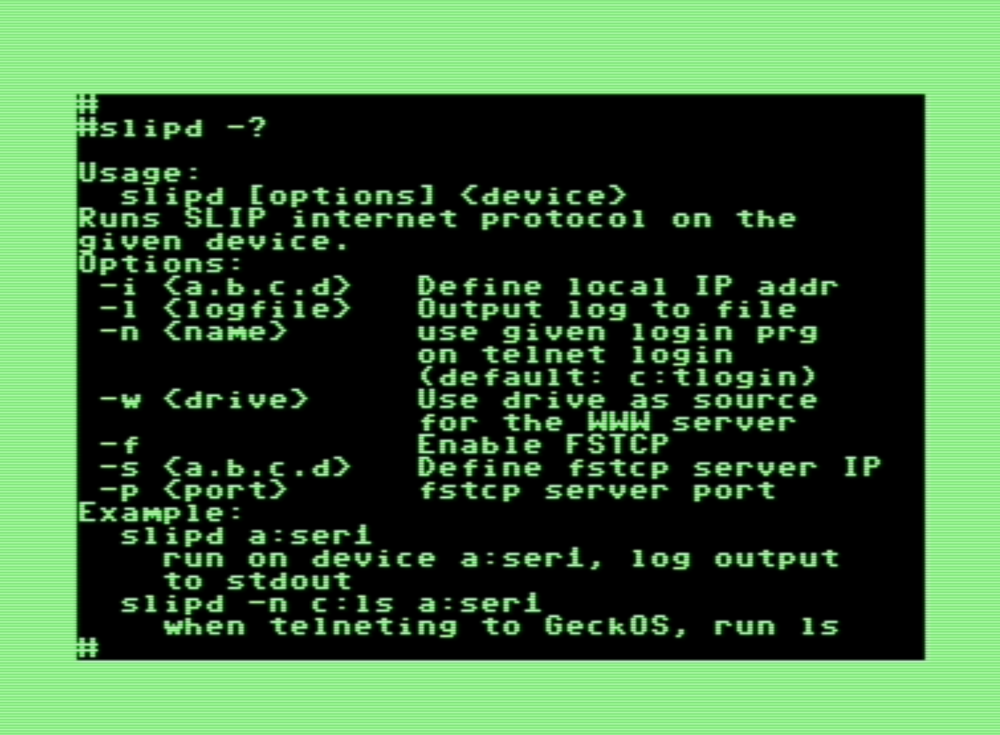
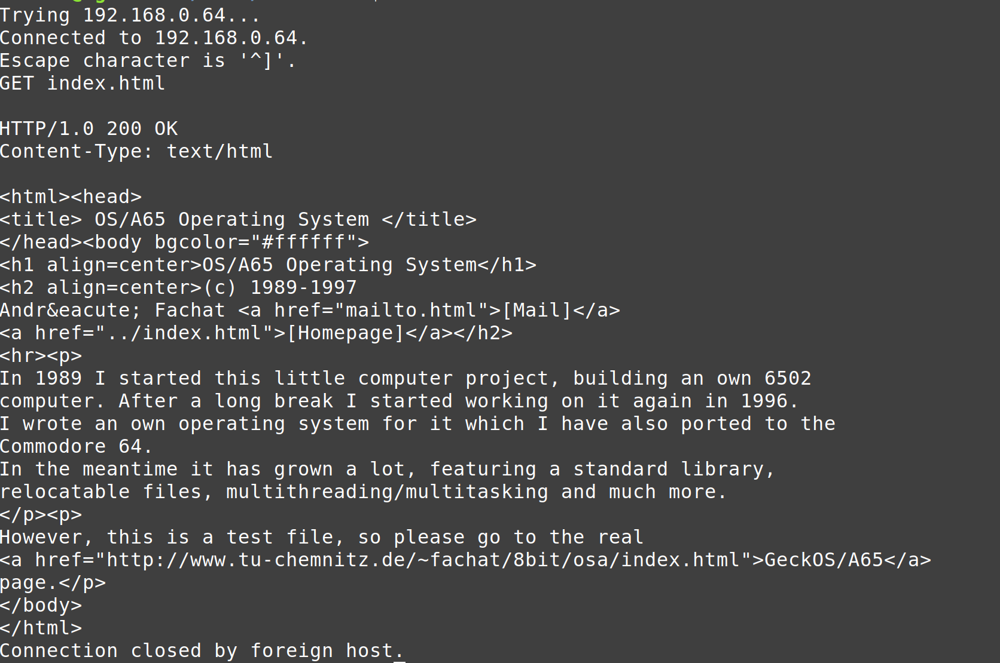

= SLIP(7)
:doctype: manpage

== NAME
slip - description of the Serial Line TCP/IP implementation for GeckOS

== DESCRIPTION

----
                   TCP/SLIP implementation for the OS/A65
                           (c) 1997-2020 A. Fachat
----

WARNING: This code is experimental and in a late Beta now! 
   It has bugs, and may damage files on your computer! 
   The programs are provided "as is", there is no warranty at all,
   and the usual disclaimers apply.
   I you are a beginner, forget it. This is (still) advanced stuff.

WARNING: Never, never ever run the "fstcp" server on a computer connected
   to the Internet! 
   It has no other security protection than checking the IP address of
   an incoming connection request!
   
WARNING: Never, never ever run the WWW server on the OS/A computer (C64), if 
   it is connected to more than your home PC. It reads all files from 
   the specified (C64 or OS/A) drive!

== PURPOSE
Now that you're warned: What's it for?

The TCP/SLIP implementation can be used for telneting to and
   from an OS/A65 computer. Now it's used to transfer files between an 
   OS/A65 computer and a (Unix) computer. It can also be used as a simple
   WWW server now.

I use it on a C64, to transfer files between a PC and a VC1541 disk.
   
The lowest level you can see is the icmp (internet control message
   protocol) level. If you "ping" the OS/A65 computer, it replies.
   See "man ping" on a Unix machine. It also replies to "traceroute" 
   packets appropriately.

Then there are the simple test TCP ports "echo" (7), "discard" (9) and
   "chargen" (19). You can telnet to these ports on the OS/A65 computer.
   See "man telnet" on how to telnet to a different port.

Another special port is the http port (80). This port is used to 
   transfer html pages for the World Wide Web (WWW). A special server
   is listening on this port and serves requests from a given directory.

The next level is a client-server-application. The server "fstcp"
   runs on a connected (unix) system. The client "slipd" runs on the
   GeckOS machine. It tries to connect to a remote server (the fstcp
   program on the unix machine) and establishes a TCP connection to the
   server. This connection is then used to transfer file data.

The "slipd" internet daemon exports internet capabilities to the 
   lib6502 library. This is actually the only part that still seems
   to be buggy. The www server built into slipd is quite stable, as
   is the rest of the OS (has been running for several days without
   problems)

The default configuration for slipd (see sysapps/slipd/main.a65)
   is to run the builtin WWW server, the telnet server (starts
   the apps/inet/tlogin program for login) and the lib6502 stuff.
   You have to change login/password/shell in tlogin.a65 to your 
   preferences.

With the lib6502 inet stuff the apps/inet/telnet program opens
   a telnet connection to the host given at the command line
   (in doted quad notation).

The procedures described here are for a Linux machine and a C64
   with GeckOS running. For the serial line setup you need root 
   (superuser) access to the unix machine. It should run without
   any changes on any OS/A65 machine with a serial line.

== IP CONCEPTS

=== addresses

In an IP (internet protocol) network, each computer has an IP number.
   Normally you have to formally apply at the network information center
   for an IP number or net. But there are numbers assigned to be used
   in private, non-connected networks.

IP addresses are usually noted in the "doted quad" notation, i.e.
   four decimal values from 0-255 each, separated by dots.

The private network I use is are the numbers

      192.168.0.*

i.e. the numbers 192.168.0.1 - 192.168.0.254. There are two numbers
   missing, they are used as network address (0) and normally as broadcast
   address (255).

My unix (i.e. Linux) computer at home has the IP 192.168.0.10. This is
   the IP the fstcp server is running on. 
   My C64 (with the OS/A65 operating system) has the IP 192.168.0.64.
   So if the C64 has the slipd program running, I can do a 
   "ping 192.168.0.64" on my unix machine and get a reply!

=== routing

The internet protocol is a packet oriented network. A packet is
   sent from one host to another, which is normally not the final
   destination. Each host decides where to send a packet next, to get
   the packet to its destination. This process is called routing.
   Normally the program "route" is used to tell the computer which packets
   to put where.

=== preparing a serial port

If you connect a serial line from the C64 to the unix machine, the
 unix machine has to know that it has to send and which IP packets to 
 send there. There are some ways to achieve this. 

The first way is with the command "slattach", which puts the
 serial line from "terminal mode" to "SLIP" mode. Then "ifconfig"
 configures the "sl0" interface with the IP address.  The last command
 is "route", which tells the unix OS that is has to send packets to the
 C64's IP address to the interface sl0, which goes to the serial line.
 The small script "csaip", provided in the oaslip directory, does 
 everything.
 Warning: this script assumes you have network device "sl0" for the
 GeckOS link. If you have a SLIP connection somewhere else already.
 this might not be true! The script then mangles your routing tables!

Another way is the program "diplogin" or "sliplogin" which does everything,
 see the appropriate man pages.
 
I have added a program "term9600" which is a little C64 BASIC terminal 
 program to run the serial line at 9600 - if the kernel ROM allows that.
 It can be used to login to the remote host if necessary.

== TCP concepts

=== addresses

TCP addresses not only contain the IP address of the host, but also
   the "port". The Port is like the number of the flat in a house, when the
   IP number is the address of this house. Certain port numbers are
   registered for a special use. Port 7 (echo) for example will send
   all data you send to it back. 
   When you open a connection to a port on a remote computer, your own 
   computer also assigns a local port number to the connection, to have
   a full TCP address at the sender side.

=== connections

In contrary to the IP protocol, the TCP is a connection based protocol.
   A connection always takes place between two TCP "ports" or
   two "pairs of IP and TCP port numbers". This connection is defined
   with the properties:
     - no data "overtakes" data sent before 
     - no data is lost
     - no data is doubled
   (which are all effects that can occur on IP)
   With retransmissions, sequence numbers and lots of other things the
   TCP ensures that the data is received in order and nothing is missing.

=== establishing a connection

Normally one side creates a "socket" and "binds" it to a specific
   local TCP/IP address. It can then either "connect" to a remote
   socket, or "listen" for remote connect requests. If the socket
   listens on a port, the "accept" call will bind the local and remote
   socket to a valid connection.

Normally a server program listens on a socket while the client tries
   to connect to it.

=== used ports

I chose to use port "8090" as the port where the fstcp server is 
   listening at.
   The WWW server built into slipd listens at the standard port 80,
   and the telnet connection is listening at the standard telnet port (23).

== Building the programs

=== the "fstcp" server

The fstcp server is a C program, in sysapps/slipd/fstcp.c. Going to the 
   slipd directory and typing "make fstcp" should work on unix (linux) 
   machines. In the first lines the port is defined where the server is 
   listening at. 

=== the "slipd" client.

Most other files in the sysapps/slipd directory are to build the slip client.
   In the first lines of "main.a65" the OS/A65 IP address (MY_IP) is defined.
   (note the comma instead of the dots!). But the slipd server listens
   for incoming packets and sets its own IP address if necessary.  
   Also the fstcp server TCP address (IP and port) are defined there.
   The WWW server defines its drive and directory it will read the files
   from. Do _never_ specify a drive on the fstcp filesystem. The slipd prg
   will hang on the first access!
   
To assemble the files, you have to have my 6502 crossassembler "xa" 
   in you path, with version above 2.1.4d.

The slipd program is built when running "make" in the sysapps/slipd 
   subdirectory.

== running the program

To run the program, do the following steps:

    - connect the C64 (either with Daniel Dallmans 9600 baud interface,
      or any other RS232 interface supported by OS/A65) and a serial
      port of the (Linux-) PC with a Nullmodem cable.
      The standard C64 configuration allows an UART16550 at address
      $d600. To change that have a look at arch/c64/c64rom.a65, which
      holds the configuration for the C64.
      
    - enable SLIP on the serial line by running something similar to 
      the script sysapps/slipd/csaip (does slattach, ifconfig, route).

    - If you want fstcp services, start the fstcp server on the unix 
      host. As arguments it needs the directory (relative from the 
      starting directory) to export and the IP address to which to export 
      the directory.
      As fstcp might very well be buggy, try to be as cautions as
      possible. Never ever run it on a computer connected to the internet.
      Never ever run it as root (superuser). 

    - Transfer the slipd file to a disk accessible to the C64 when running
      GeckOS (using an x1541 cable, for example)

    - start GeckOS on the C64 (see other files, like README.c64)

    - You should have a shell prompt (">") with a binking cursor.
      Now start the slip.obj program by typing
----
          slipd a:ser1
----

This starts the slip client from drive c: (usually Commodore serial 
      IEC device #8, the floppy disk), using device *ser1* as 
      SLIP I/O device (in standard C64 OS/A65 it's now the swiftlink
      RS232 interface, see below; Daniel Dallmanns 9600 baud interface
      can alternatively be used but needs to be built into the system). 
      
    - Log output can be sent to another file or terminal using the *-l* parameter.

    - With the *-w* parameter the drive to use as WWW server file source is set. 

    - Use *-n* to set the program to run when someone telnets into the system.

    - *-i* defines the local IP address.
      
 

    - If enabled with *-f*, the slip client registers an *fstcp* filesystem with one drive. 
      On a standard C64 OS/A65 system, it will be drive g:.
      This connects to a server on the internet, whose address and port
      can be given with *-s* and *-p* options.
      If a connection to the server cannot be found, or breaks
      later, the fstcp tries to reconnect in periodic intervals.

    - You should now be able to ping the C64, and do telnets to the 
      echo, discard and chargen ports.

    - when telneting to the http port (80)
      (When the WWW server is enabled in oaslip/main.a65), you can issue
      the "GET" command, followed by an URL on the OS/A65 computer.
      You then get the specified file.
      You can also point your Web browser (netscape) to the C64
      with the URL "http://192.168.0.64/index.html". Replace the IP
      number with the one you have chosen for your system.

    - If fstcp is enabled, it should now also be possible to show the 
      directory of drive g:, and to read files from or write files to 
      drive g: This drive will be the contents of the directory given to 
      the fstcp server, i.e. on your Unix machine!

== Running the program in VICE

You can use VICE using this command line to start with "socat" as serial device, creating
a Pseudo TTY for this slattach to use.

In the x64 emulator the userport 9600 baud interface does not 
work well enough with GeckOS, 
so the swiftlink emulation should be used (as a:ser2 in GeckOS):

----
       x64 -acia1 -acia1base 0xDE00 -acia1irq 2 -acia1mode 1 -myaciadev 2  -rsdev3 "|socat - PTY,link=/tmp/viceser"  -autostart osa.d64
----

Then run this script as

       sudo ./csaip -d /tmp/viceser

(where the *-d /tmp/viceser* is optional if you don't change the above VICE setting) and to debug you can use 

       sudo tcpdump -i sl0 -XX -tttt -v

Alternatively use

       sudo ./csaip -l

Then, in GeckOS in x64, run

       slipd a:ser1 

as a minimum slip daemon that uses "a:ser1" as I/O, which is the default RS232 interface on the C64 arch (Swiftlink with NMI or userport 9600 depending on the build)

== Using the internet connectivity

=== remote shell

The full *slipd* or the reduced *sliprshd* provide the abiltiy to login to GeckOS over the internet.

When a process connects, slipd starts a specific login program. By default this is *c:tlogin* which just asks for the username and password. As *tlogin* is just a sample, username and password are hardcoded to "c64" and "guest". Also, the shell to start upon successful login is *c:lsh*.

=== Connecting to the internet

The full *slipd* or the reduced *slipmind* provide the ability for *lib6502* programs to use internet connectivty. A sample *telnet* client is included in GeckOS. Also, there is a *httpd* HTTP server based on the lib6502 binding (and thus not integrated into *slipd* that servers files from a GeckOS disk.

image::telnet.png[] 

=== Running as web server

The full *slipd* or the reduced *slipwwwd* implement a very (very very) simple web server for HTTP 1.0. The best way to connect to is probably by using a telnet client as shown in the following screenshot.

 

=== Using a server on the internet as file server

Using either the full *slipd* or the reduced *slipfsd* server, GeckOS can use a remote server as fileserver. As protocol the FSTCP GeckOS-specific protocol is used, which is basically the GeckOS internal protcol between clients and file serves.

First you have to run
----
	fstcp <directory> <servername>
----
where *fstcp* is the host binary compiled from *sysapps/slip/fstcp.c*. The directory is the one to be exported. The *servername* is the IP address the server uses - this is relevant as when using SLIP your server may have multiple IP addresses and the program needs to attach to the correct one. In the above SLIP scenario, servername could be *192.168.0.1*.

Then start *slipfsd* in the background, e.g. using
----
	ontty a:video2 slipfsd a:ser1
----
Then a new drive *g:* should be available.

Note:: in my latest tests this did not work.

== (Known) Bugs

   - The WWW server only understands "GET filename" requests. No "http://"
     or host prefixes are allowed. At least with Netscape it seems to work.

   - telnetting into GeckOS seems to echo shell input when it shouldn't

   - When telnetting out, and the connection got a RST, telnet seems to hang.
     (unclear if that is telnet or lib6502)

   - FSTCP does not seem to work anymore.

   - The implementation is bloated, and horribly slow.

   - Tons of others, I'm sure

   - lib6502 binding seems to bug. 

   - in VICE, the 9600 baud interface does not work well enough with GeckOS' implementation. Use the following command line if you want to test it (you have to build the userport 9600 baud interface into the system by modifying *arch/c64/devices/c64dev.a65*.:
----
       x64 -rsuser -rsuserdev 2 -rsuserbaud 9600 -rsdev3 "|socat - PTY,link=/tmp/viceser"  -autostart osa.d64
----

== SEE ALSO
link:c64.p.adoc[c64(p)]

== AUTHOR
Written by André Fachat.

== REPORTING BUGS
Please report bugs at https://github.com/fachat/GeckOS-V2/issues

